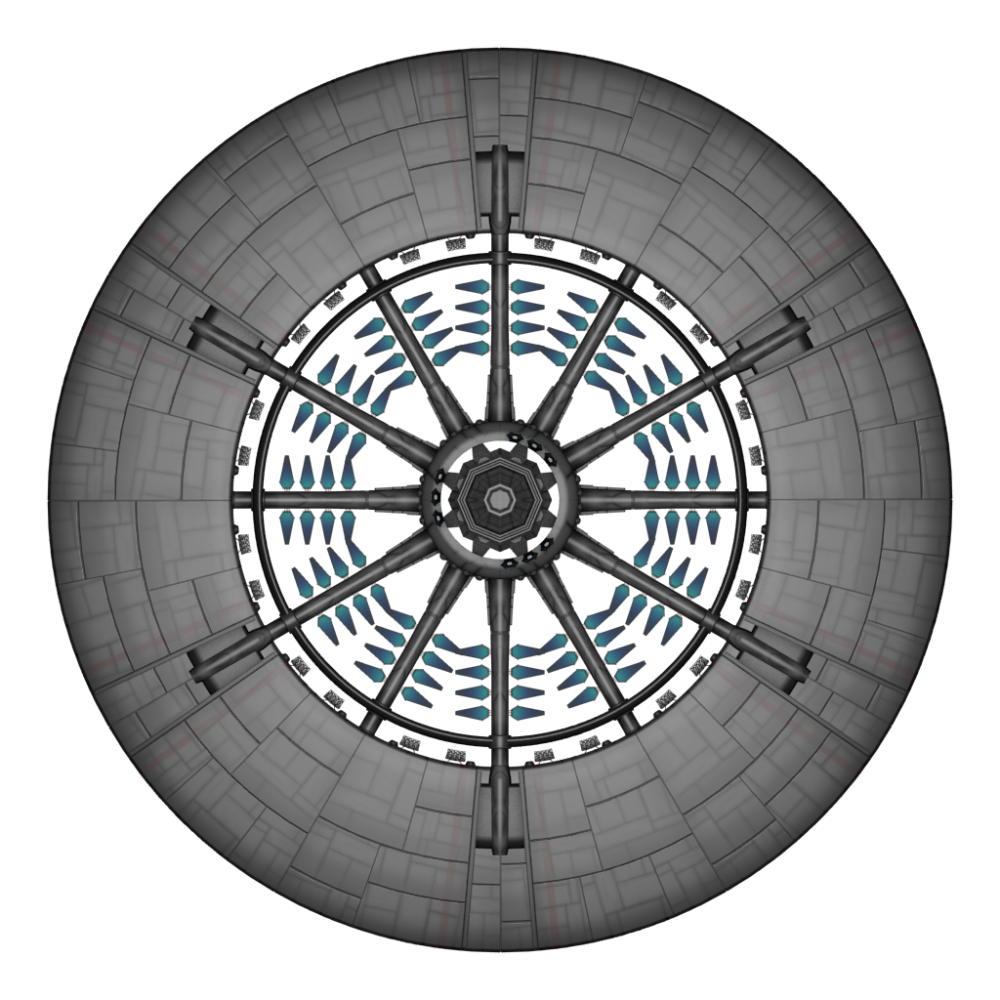

# Father, Where Are You?

Play as a member of the Xerathans, avenge your father against the human race, and find your father. 

## Instructions

| Game Element                            | Description                                                               |
|:----------------------------------------|:--------------------------------------------------------------------------|
|  | You are a member of the Xerathans.   Use the arrow keys or W and S to move the player up and down. Use the space key to attack!               |
|  | Satellite deployed by the minions of Earth!   Once detected by it, it shoots lasers at a rapid pace! 
|   | That speed is no joke.   Double the laser and double the speed of the satellite! |
|   | Slow, but dangerous!   Shoots bomb that rapidly decreases your health! Destroy the bomb with your lasers! |
|    | Final boss!   Use both laser and bomb attacks, beware!                          |

## Author 
| Name                  | UD Email               |
|:----------------------|:-----------------------|
| Winnie Li             | winnie@udel.edu        |
| Joshua Chelen         | jchelen@udel.edu       |

## Credits 
- Cutscenes animated by Joshua Chelen 
- "Player Fighter Jet" by Joshua Chelen 
- "Satellite Base" by Joshua Chelen 
- "Satellite Dish" by Joshua Chelen
- "Drone Gunner" by Joshua Chelen
- "Drone Bomber" by Joshua Chelen
- ["Textured Space Station" by MillionthVector](https://opengameart.org/content/textured-space-station)
- ["Space Shooter Art" by Kenney](https://opengameart.org/content/space-shooter-art)
- ["Sci-Fi UI Panel" by bart](https://opengameart.org/content/sci-fi-ui-panel)
- ["Camera Mapped Space Background" by Explosive Ninja](https://opengameart.org/content/camera-mapped-space-background)
- ["Space Background 01" by Satur9](https://opengameart.org/content/space-background-01)
- ["Battle in the Winter" by jobromedia](https://opengameart.org/content/battle-in-the-winter)
- ["Through Space" by maxstack](https://opengameart.org/content/through-space)
- ["The Sad Battle" by Eldritch Grim](https://opengameart.org/content/the-sad-battle)
- ["Menu Music" by mrpoly](https://opengameart.org/content/menu-music)
- ["Heroic Deminse [Updated Version]" by Matthew Pablo](https://opengameart.org/content/heroic-demise-updated-version)
- ["The Fallen (RPG Orchestral Essentials) - Defeated Music" by Inspector J](https://opengameart.org/content/the-fallen-rpg-orchestral-essentials-defeated-music)
- ["Menu Selection Click" by NenadSimic](https://opengameart.org/content/menu-selection-click)
- ["Laser Shot" by Mobeyee Sounds](https://opengameart.org/content/laser-shot-0)
- ["Mechanical Explosion" by Spring Spring](https://opengameart.org/content/mechanical-explosion)

## Game Plan 

- [X] Wanderer Exist: *A wanderer is on the screen.*
- [X] Wanderer Moves: *The wanderer can move up and down with arrow keys.*
- [X] Wanderer Attack: *The wanderer can shoot a laser with the space key.*
- [X] Screen Limits: *The wanderer cannot be moved offscreen.*
- [X] Spawning Enemy Satellite: *Satellite spawns randomly within given boundaries.*
- [X] Satellite Moves: *Satellite move from right to left.*
- [X] Enemy Drones: *Enemies that shoots laser and bomb.*
- [X] Boss Enemy: *Spawns after a set amount of time. Shoots both lasers and bomb.*
- [X] Wanderer Hurt: *If an enemy collides with a wanderer, it loses health.*
- [X] Display Stats: *The screen will display the current score and health.* 
- [X] Game Over: *Scene that plays after the player dies.* 
- [ ] Story/Ending Screen: *Cutscenes.*
- [X] Home Screen: *Main menu screen exists.*
- [X] Instruction Screen: *Screen with player instructions.*

